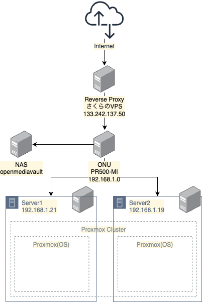
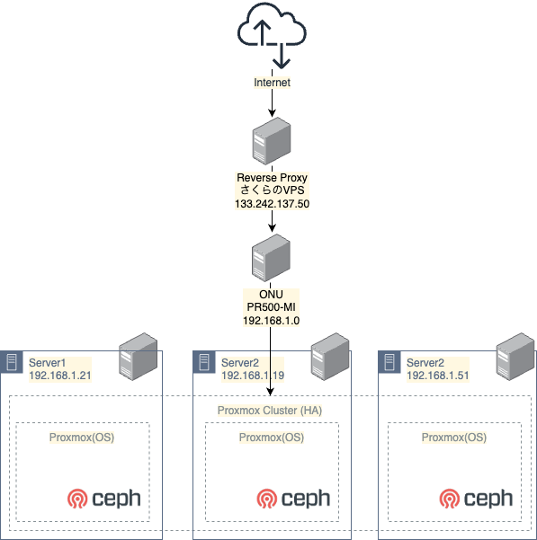
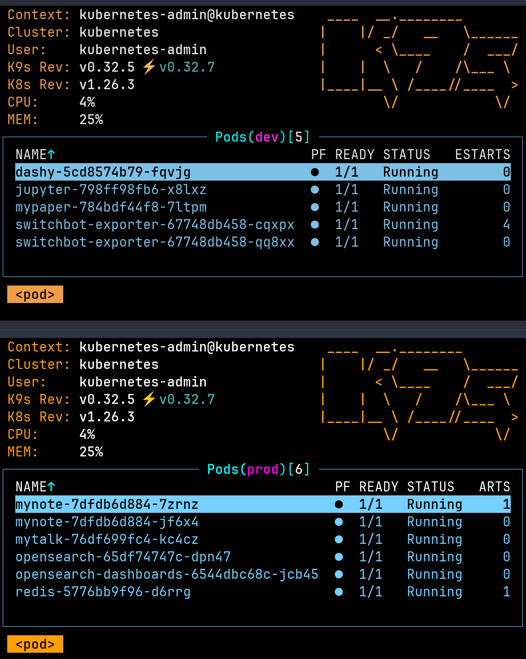
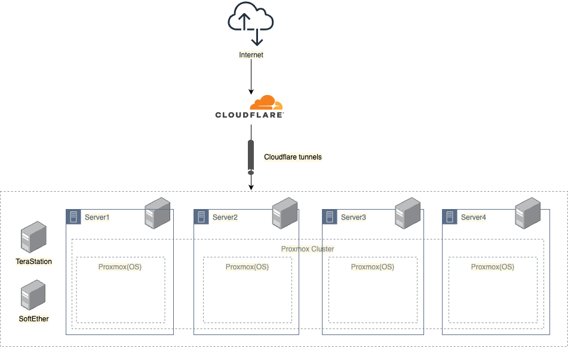
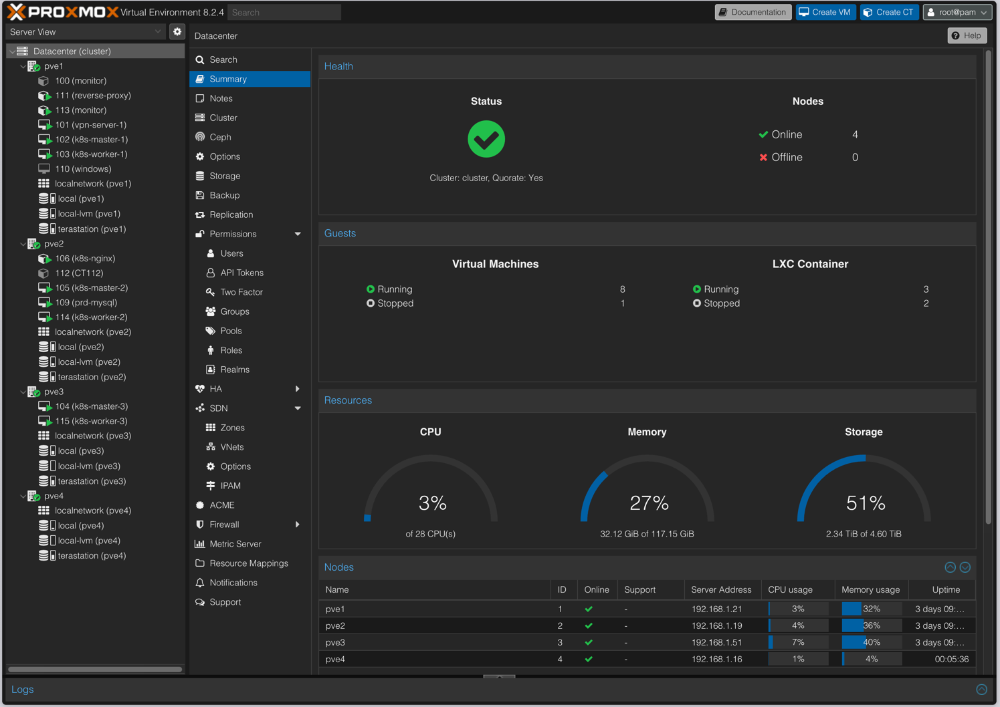

<!--
_class: lead
_paginate: false
_header: ""
-->
# ぼくの自宅サーバー育成日記
---

# サーバー2台時代

- サーバー2台構成でProxmox Cluster
- ストレージはNAS(openmediavault)で用意
- 前段にReverseProxyを用意。それを経由して自宅ネットワークへ接続

---

# HA構成・Ceph時代

- サーバー3台構成でProxmox Cluster
  - → HA構成へ
- ストレージはCeph Clusterで用意
  - ~~Cephのご機嫌取りはここから~~
- しばらくこの構成のままで運用

---

# Kubernetes Migration

- Proxmox Cluster上にVMを6台構築
  - Control plane 3台
  - Worker Node 3台
- ほとんどをVM,CTからKubernetesに移行

---

# 現在の構成

- Region 2（一人暮らし）へ大移動
- Reverse proxyからCloudflare tunnelsへ
- CephからTeraStationへ
- 4台+VPN1台構成へ

---

---

# 載せているアプリケーション

- 自作アプリケーションのバックエンド
  - [MyNote](https://mynote.euchi.jp/)
  - [MyTalk](https://mytalk.euchi.jp/)
  - MyPaper
- マイクラサーバー
- Grafana, Prometheus
- SwitchBot
- SoftEther ...

